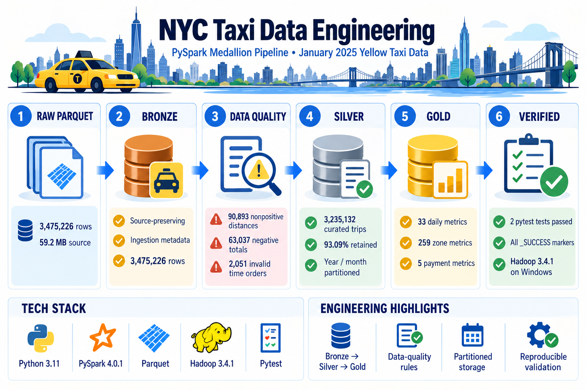

# NYC Taxi Data Engineering Pipeline

A PySpark data-engineering project that transforms NYC Yellow Taxi trip records from raw monthly
Parquet files into validated, partitioned, analytics-ready datasets and aggregate data marts.



## Why this project exists

This repository focuses on **data engineering**, not dashboard design:

**PySpark · Spark SQL · Parquet · Data Quality · Layered Data Architecture · Partitioning · Tests**

## Architecture

```text
NYC TLC Parquet
      |
      v
 PySpark ingest
      |
      v
   BRONZE
source-preserving
      |
      v
Data Quality Rules
      |
      v
   SILVER
clean trip-level data
partitioned year/month
      |
      v
    GOLD
daily / zone / payment metrics
      |
      v
 Spark SQL analysis
```

See [`docs/architecture.md`](docs/architecture.md) for details.

## Dataset

The project is designed for the **official NYC Taxi & Limousine Commission Yellow Taxi Trip
Record Data**. TLC publishes monthly trip records in Parquet format. Yellow Taxi records include
pickup/drop-off timestamps and locations, trip distance, fares, payment information, and
passenger-count fields.

Official source:
https://www.nyc.gov/site/tlc/about/tlc-trip-record-data.page

The repository does not commit the raw trip files. Download a Yellow Taxi monthly Parquet file
from the official source and place it under `data/raw/`.

Example expected filename:

```text
data/raw/yellow_tripdata_2025-01.parquet
```

## Pipeline

### Bronze
- Reads Parquet with PySpark.
- Checks required analytical columns.
- Preserves source columns.
- Adds ingestion timestamp and source-file metadata.

### Silver
- Rejects missing or invalid timestamps.
- Rejects non-positive/extreme distances.
- Rejects negative fare/total amounts.
- Validates pickup/drop-off location IDs.
- Derives trip duration, pickup date/hour/year/month, and average speed.
- Writes Parquet partitioned by pickup year and month.

The thresholds are documented project rules, **not official TLC validity rules**.

### Gold
Produces three aggregate datasets:

- `daily_metrics` — trip count, distance, duration, gross amount, tips.
- `zone_metrics` — pickup-zone demand and average trip/fare metrics.
- `payment_metrics` — payment-type trip and tip metrics.

## Repository Structure

```text
nyc_taxi_data_engineering/
├── data/
│   ├── raw/
│   ├── bronze/
│   ├── silver/
│   └── gold/
├── docs/
│   ├── architecture.md
│   ├── data_quality.md
│   └── project_log.md
├── sql/
│   └── analytics.sql
├── src/
│   ├── config.py
│   ├── pipeline.py
│   ├── quality.py
│   ├── schema.py
│   └── spark_session.py
├── tests/
│   ├── conftest.py
│   └── test_pipeline.py
├── main.py
├── requirements.txt
└── README.md
```

## Run Locally

Prerequisites:
- Python 3.10+
- Java compatible with your PySpark installation

```bash
python -m venv .venv
# Windows:
.venv\Scripts\activate

pip install -r requirements.txt
python main.py --input data/raw/yellow_tripdata_2025-01.parquet
```

Run tests:

```bash
pytest -q
```

## Example Spark SQL Questions

The repository includes `sql/analytics.sql` for:
- peak pickup hours,
- busiest pickup zones,
- daily operational trends,
- payment-type behavior.

## Portfolio Talking Points

- Designed a layered Bronze/Silver/Gold data pipeline using PySpark and Parquet.
- Added explicit schema/data-quality validation before downstream analytics.
- Created reusable transformations and partitioned curated data by year/month.
- Built Gold-level aggregate datasets for operational analytics.
- Added Spark SQL queries and automated PySpark tests.

## Scope

This is a local portfolio implementation. It does **not** claim cloud deployment, cluster
benchmarking, or production SLA performance.
